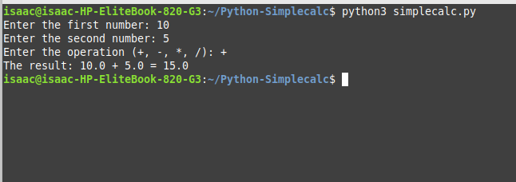

# Simple Python Calculator

  

## Overview

This project is a **Simple Python Calculator** that operates in a command-line interface (CLI). It allows users to perform basic arithmetic operations: addition, subtraction, multiplication, and division. The program takes input from the user for two numbers and an arithmetic operation, performs the operation, and then outputs the result.

This calculator is ideal for quick calculations and provides basic input validation to ensure correct input types and operations.

## Features

- **Basic Operations**: Addition, subtraction, multiplication, and division.
- **Input Validation**: Ensures that the user inputs valid numbers and operations.
- **Command-Line Interface**: Easy-to-use interface that runs directly in the terminal or command prompt.

## Installation

### Prerequisites

To run this program, you need:
- **Python 3** 

### Steps to Install

1. **Clone or Download the Repository**
   - To clone the repository, run:   git clone https://github.com/aizocraft/Python-Simplecalc.git
   - Or you can download the repository as a ZIP file.

2. **Running the program**
   - Open a terminal or command prompt.
   - Navigate to the folder where the simplecalc.py file is located.
   - Run: python simplecalc.py

**Input**
    The program will ask you for:
    - First number: The first operand in the arithmetic operation.
    - Second number: The second operand.
    - Operation: Choose an arithmetic operation: +, -, *, or /.   